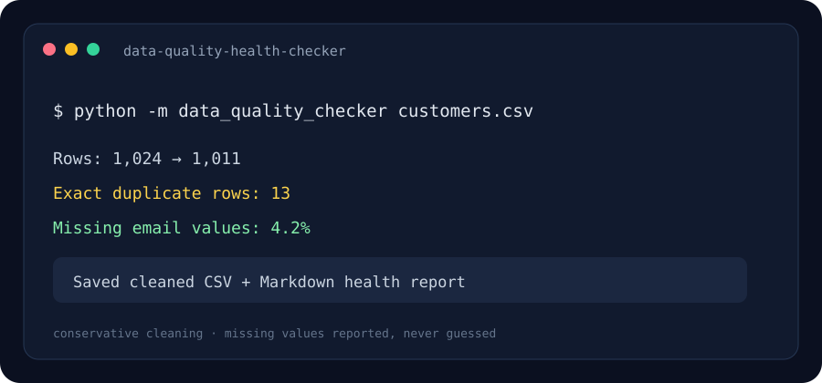

# Data Quality Health Checker

A focused CLI that profiles CSV or Excel data, applies conservative cleanup, and writes a Markdown health report beside a cleaned copy.

> The image above is an illustrative terminal preview.

## Problem it solves

Datasets often contain blank strings, inconsistent whitespace, duplicate records, and columns that appear to hold dates but contain invalid values. This tool makes these issues visible before analysis or import.

## Quick start

Requires Python 3.10 or later.

~~~powershell
python -m venv .venv
.venv\Scripts\Activate.ps1
python -m pip install -r requirements.txt
python -m data_quality_checker ./customers.csv
~~~

The command creates customers.cleaned.csv and customers.health.md. XLSX inputs produce a cleaned workbook by default. Macro-enabled XLSM files are intentionally excluded so the tool cannot silently drop VBA macros.

Keep duplicates while still reporting their count:

~~~powershell
python -m data_quality_checker ./customers.csv --keep-duplicates --output ./cleaned.csv --report ./health.md
~~~

## Checks and cleanup

- Reports row count, column count, inferred dtype, missing-cell count, missing percentage, and distinct-value count.
- Flags invalid values in columns with names that suggest dates or timestamps.
- Trims leading and trailing whitespace from text cells.
- Treats empty text as missing.
- Drops exact duplicate rows by default; use the keep-duplicates flag to retain them.
- Leaves missing values untouched instead of guessing replacements.

## Project layout

- **data_quality_checker/health.py** — profiling, conservative cleanup, and report generation.
- **data_quality_checker/cli.py** — file selection and output paths.
- **assets/preview.svg** — illustrative terminal preview.

## Tech stack

Python · pandas · openpyxl · tabulate

## Data handling notes

The tool reads the input locally and writes a separate cleaned copy. It does not upload data. Review the report and cleaned output before replacing or sharing a source dataset. Date checks are heuristic and use column names as a signal.

## License

MIT.
